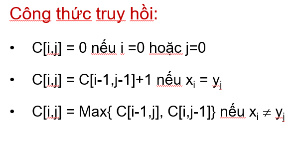
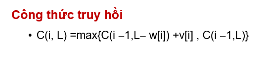
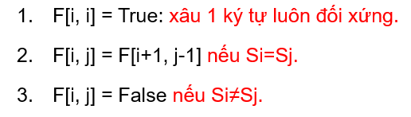
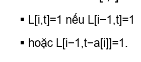

# tong phan tu bang K
    if a[j] <= i then f[i] += f[i]-f[i-a[j]];
# ky tu giong nhau
    f[i]: thoi gian toi thieu tao i ky tu
    insert: default f[i-1]+x (1)
    chan - coppy: f[i/2]+z (2)
    le - coppy: f[(i+1/2)]+y+z (3)
    f[i] = min((1)+(2)) || min((1) +(3))
# giai ma
    f[i]: so cach tao day
    f[0] = 1;
    if s[0] = 0 return;
    else f[1] = 1
    for i = 2 to n:
        f[i] = 0
        if s[i-1]>0 f[i] += f[i-1]
        if s[i-2] = 1 || s[i-2] == 2 && s[i-1] < 6:
            f[i] += f[i-2]
# day con chung dai nhat
    

# bai toan cai tui
    

# xau con doi xung
    

# day con co tong bang s
    

# hinh vuong co S max
    if(a[i][j])
        c[i][j] = min(c[i-1][j]+1,  min(c[i][j-1])+1)

